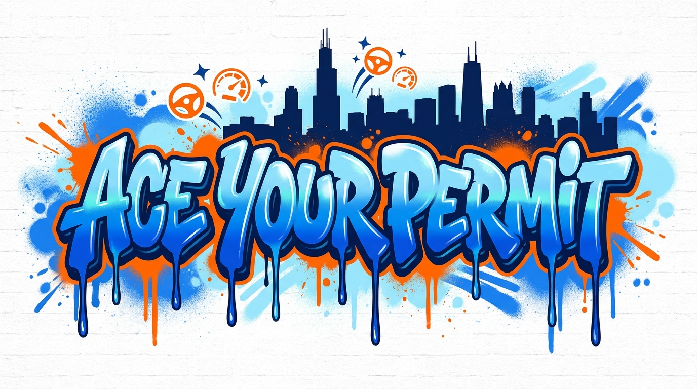

<p align="center">
  
</p>

<h1 align="center">Ace Your Permit</h1>

<p align="center"><strong>Pass your driving test. Have fun doing it.</strong></p>

<p align="center">
  A gamified, open-source driving test prep app. Duolingo-style XP, streaks, leaderboards,
  and a hype-beast mascot named Dash who explains why you got that question wrong.
</p>

<p align="center">Illinois first. Every state and country next.</p>

<p align="center">
  
  
  
  
</p>

---

## Table of Contents

- [What Makes This Different](#what-makes-this-different)
- [Quick Start](#quick-start)
- [Tech Stack](#tech-stack)
- [Project Structure](#project-structure)
- [Contributing](#contributing)
- [Feature Flags](#feature-flags)
- [Design System](#design-system)
- [License](#license)

## What Makes This Different

Most driving test apps are boring quiz sites covered in ads. Ace Your Permit is built for anyone procrastinating on their Illinois permit test — teens, adults, new residents, retakers, all of it:

- **Gamification that works** — XP, 20 levels, daily streaks, achievements, weekly leagues (Bronze to Diamond)
- **Dash the mascot** — a hype-beast car who explains your mistakes in Gen Z language
- **AI explanations** — powered by synthetic.new, Dash tells you WHY you got it wrong
- **Head-to-head challenges** — challenge friends with a shareable link, compare scores
- **Test day countdown** — readiness score tracks your weak categories so you know when you're ready
- **Share your score** — achievement cards optimized for Instagram Stories and TikTok
- **Parent progress updates** — parents get weekly email digests of their teen's study progress
- **Works offline** — PWA that installs on your phone
- **Two languages** — English + Spanish UI

## Quick Start

```bash
git clone https://github.com/h3cz/drivemaster-app.git
cd drivemaster-app
npm install
cp .env.example .env.local
# Fill in Supabase credentials (see docs/deploy-guide.md)
npm run dev
```

Open [http://localhost:3000](http://localhost:3000).

## Tech Stack

| Layer | Tech |
|---|---|
| Framework | Next.js 16 (App Router) + TypeScript |
| Styling | Tailwind CSS 4 + shadcn/ui + Framer Motion |
| Backend | Supabase (Auth, PostgreSQL, Realtime) |
| State | Zustand + TanStack React Query |
| AI | synthetic.new API (wrong answer explanations) |
| Email | Resend (parent digest) |
| Images | Vercel OG (share cards) |
| Tests | Vitest + React Testing Library |
| Deploy | Vercel |

## Project Structure

```
drivemaster-app/
  app/
    (auth)/              Login, signup
    (dashboard)/         Main dashboard + countdown widget
    (onboarding)/        6-step new user flow
    (quiz)/              5 quiz modes + results + sharing
    challenge/[id]/      Head-to-head challenge page
    parent/link/         Parent account linking
    api/                 API routes (questions, leaderboard, challenges, explain, parent, OG images)
  components/
    mascot/              Dash emotions + speech bubbles
    quiz/                Question cards, share button, AI explanation
    challenge/           Challenge create + compare
    countdown/           Test day countdown widget
    layout/              Mobile nav + desktop sidebar
  hooks/                 Quiz state, countdown, leaderboard, touch, PWA
  lib/
    gamification/        XP calculator, achievements, leagues, levels
    data/questions/      Question banks (Illinois, contribute yours!)
    feature-flags.ts     Feature toggles for safe rollout
    i18n.ts              Internationalization config
  messages/              EN + ES translation files
  __tests__/             Unit tests (XP calculator, question schema)
  DESIGN.md              Full design system (colors, fonts, spacing, motion, Dash personality)
  CLAUDE.md              AI assistant conventions
```

## Contributing

**The easiest way to contribute: add questions for your state or country.** No coding required — just knowledge of your local driving rules.

See [CONTRIBUTING.md](./CONTRIBUTING.md) for the full guide and [docs/question-bank-spec.md](./docs/question-bank-spec.md) for the question format.

### Currently Available
- Illinois (697 questions across 9 categories)

### Wanted
- California, Texas, Florida, New York, Ohio (highest population)
- Any US state or international question bank

## Feature Flags

All growth features ship behind flags for safe rollout:

```bash
NEXT_PUBLIC_FEATURE_COUNTDOWN=true        # Test day countdown widget
NEXT_PUBLIC_FEATURE_SHARING=true          # Achievement share cards
NEXT_PUBLIC_FEATURE_AI_EXPLANATIONS=true  # AI wrong answer explanations
NEXT_PUBLIC_FEATURE_CHALLENGES=true       # Head-to-head challenges
NEXT_PUBLIC_FEATURE_PARENT_NOTIFICATIONS=true  # Parent email digests
NEXT_PUBLIC_FEATURE_I18N=true             # Spanish UI translation
```

## Design System

See [DESIGN.md](./DESIGN.md) for the complete design system:
- **Fonts:** Cabinet Grotesk (display), DM Sans (body), JetBrains Mono (data)
- **Colors:** Electric Blue primary, Hot Orange accent, Emerald success
- **Dash personality:** Hype-beast friend. Ultra-casual Gen Z tone. Never says "incorrect."

## License

- **Code:** [MIT](./LICENSE)
- **Question banks:** [CC BY-SA 4.0](./LICENSE)

---

<p align="center">Built to help drivers everywhere pass their test.</p>
